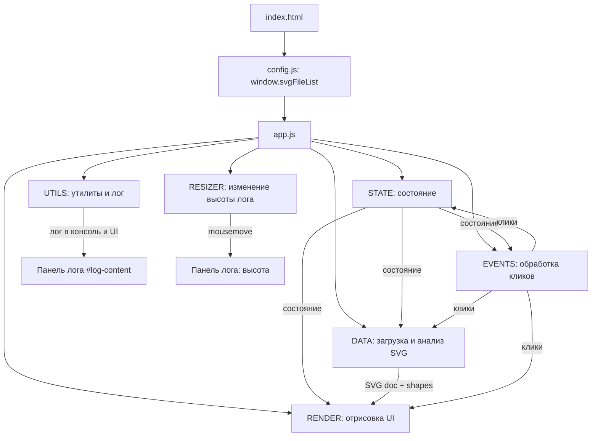
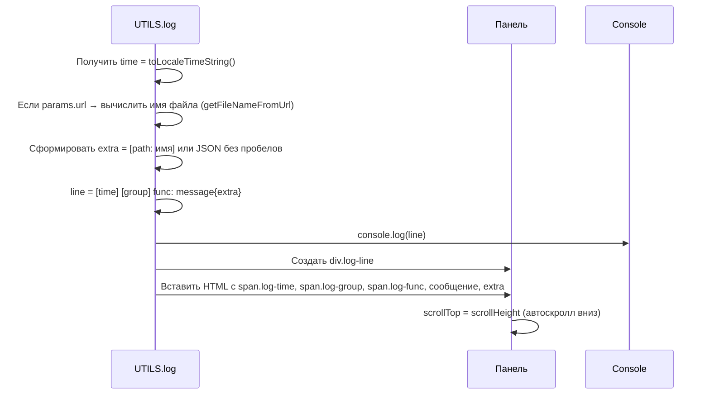
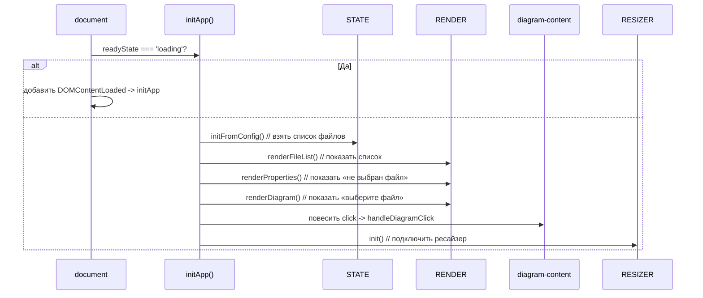
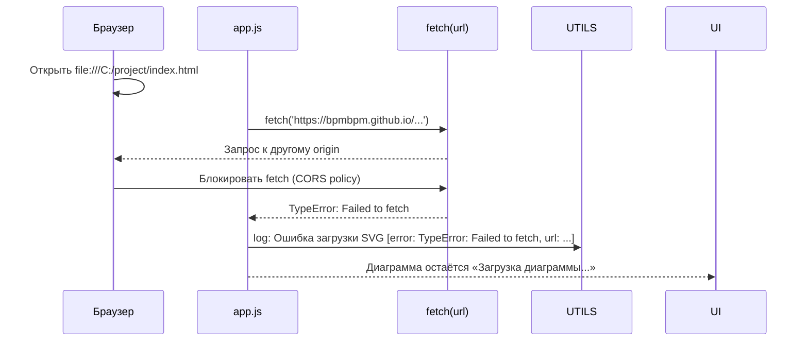

Ниже — максимально подробное описание архитектуры и логики кода `app.js` с диаграммами в Mermaid. Оно раскрывает, как модули взаимодействуют, как течёт состояние и где именно появляются нужные тебе логи.

---

## Общая архитектура приложения (High‑Level)

Это модульное SPA на ванильном JS: состояние, данные, рендер, события и ресайзер разделены по объектам.



---

## Структура объекта UTILS — как работает лог «в одну строку»

Именно здесь формируется формат лога, который ты просил: одна строка, время, группа, функция, сообщение и `[path: file1.svg]`.



**Почему лог в одну строку:** CSS `white-space: pre` запрещает автопереносы, а HTML-разметка внутри `.log-line` не добавляет лишних переносов. Если в логе появились переносы — проверь, не переопределён ли стиль у `.log-line` или не вставлен ли туда `<br>`.

---

## STATE — управление состоянием

Хранит всё, что нужно для согласованности UI: список файлов, выбранный файл, SVG-документ и фигуры.

```mermaid
classDiagram
    class STATE {
        +appState: { fileList, selectedFile, svgDoc, shapes }
        +initFromConfig()
        +isValid()
        +setSelectedFile(fileUrl)
        +clearSelection()
    }
    STATE : appState.fileList : массив URL
    STATE : appState.selectedFile : URL или null
    STATE : appState.svgDoc : DOMParser doc или null
    STATE : appState.shapes : массив фигур
```

**Ключевые моменты:**
- `initFromConfig()` берёт `window.svgFileList` из `config.js`. Если его нет — список пустой.
- При выборе файла сбрасываются `svgDoc` и `shapes` — это гарантирует, что при повторном выборе будет новая загрузка.
- `isValid()` возвращает `true`, только если выбран файл. Это используется, чтобы блокировать действия (например, клик в диаграмме).

---

## DATA — загрузка и анализ SVG

Здесь живёт `fetch` и парсинг SVG. Именно тут ты увидишь ошибку CORS, если откроешь файл через `file://`.

```mermaid
sequenceDiagram
    autonumber
    participant EV as EVENTS.handleFileListItemClick
    participant D as DATA.loadSvg
    participant P as DOMParser
    participant A as DATA.analyzeShapes

    EV->>D: loadSvg(url)
    D->>D: log: Начало загрузки SVG [path: ...]
    D->>fetch: fetch(url)
    fetch-->>D: Response
    alt Не OK
        D->>D: throw Error(HTTP status)
        D->>UTILS: log: Ошибка загрузки SVG
        end
    else OK
        fetch->>D: text()
        D->>P: parseFromString(text, 'image/svg+xml')
        P-->>D: doc
        D->>doc: querySelector('svg')
        alt Нет корневого <svg>
            D->>D: throw Error('Нет корневого <svg>')
            end
        else Есть <svg>
            D->>D: log: SVG успешно загружен и распарсен
            D-->>EV: doc
            EV->>A: analyzeShapes(doc)
            A->>A: Собрать rect/circle/path/g и их атрибуты
            A-->>EV: массив фигур
            end
    end
```

**Важно:** Если ты открываешь через двойной клик (`file://`), браузер блокирует `fetch` из соображений CORS. В логе будет строка:
`[XX:XX:XX] [DATA] loadSvg: Ошибка загрузки SVG {"error":"TypeError: Failed to fetch","url":"..."}`

---

## RENDER — отрисовка UI

Модуль отвечает за синхронизацию UI с состоянием.

```mermaid
flowchart TD
    R[RENDER] --> R1[renderFileList]
    R1 -->|STATE.appState.fileList| R1a[Создать ul/li, повесить клики]
    R --> R2[renderProperties]
    R2 -->|!STATE.isValid()| R2a[Показать «Не выбран файл»]
    R2 -->|STATE.isValid() & shapes.length===0| R2b[Показать «В SVG не найдено фигур»]
    R2 -->|STATE.isValid() & shapes| R2c[Отрисовать таблицу фигур]
    R --> R3[renderDiagram]
    R3 -->|!STATE.isValid()| R3a[Показать «Выберите файл»]
    R3 -->|STATE.isValid() & svgDoc| R3b[Вставить cloneNode(svg)]
    R3 -->|STATE.isValid() & !svgDoc| R3c[Показать «Загрузка диаграммы...»]
```

---

## EVENTS — обработка действий пользователя

Здесь логика «что делать, когда кликнули».

### Клик по файлу в filelist

```mermaid
sequenceDiagram
    participant UI as UI (filelist li)
    participant E as EVENTS.handleFileListItemClick
    participant S as STATE.setSelectedFile
    participant R as RENDER
    participant D as DATA.loadSvg + analyzeShapes

    UI->>E: click(url)
    E->>S: setSelectedFile(url)
    S->>S: сбросить svgDoc и shapes
    E->>R: renderFileList()
    E->>R: renderProperties()
    E->>R: renderDiagram()
    E->>D: loadSvg(url)
    alt Загрузка успешна
        D-->>E: doc
        E->>D: analyzeShapes(doc)
        E->>R: renderProperties() // обновить таблицу фигур
        E->>R: renderDiagram() // вставить SVG
    else Ошибка
        E->>UTILS: log: Ошибка при загрузке SVG
        // UI остаётся с сообщением «Загрузка диаграммы...», лог фиксирует ошибку
    end
```

### Клик в diagram без выбранного файла

Это то место, где гарантированно появляется событие `diagram.click.no-selection`:

```mermaid
sequenceDiagram
    participant DIAG as diagram-content (click)
    participant E as EVENTS.handleDiagramClick
    participant S as STATE.isValid()
    participant U as UTILS.log

    DIAG->>E: click
    E->>U: log: Клик в область diagram
    E->>S: isValid()?
    alt false (файл не выбран)
        S-->>E: false
        E->>U: log: diagram.click.no-selection: Не выбран элемент filelist — действие невозможно
        E-->>end: ничего не менять в UI
    else true (файл выбран)
        S-->>E: true
        E->>U: log: Клик в diagram при выбранном файле (заглушка действия)
        // здесь можно добавить зум/панорамирование
    end
```

---

## RESIZER — изменение высоты панели лога мышкой

Реализован через `mousedown` → `mousemove` → `mouseup` и изменение `style.height` у панели.

```mermaid
sequenceDiagram
    participant H as Ручка .resizer-handle
    participant R as RESIZER.onMouseDown
    participant M as RESIZER.onMouseMove
    participant U as UTILS.log

    H->>R: mousedown(e)
    R->>R: запомнить startY и startHeight
    R->>document: addEventListener('mousemove', onMouseMove)
    R->>document: addEventListener('mouseup', onMouseUp)
    loop Пока двигаем мышкой
        document->>M: mousemove(e)
        M->>M: diff = startY - e.clientY
        M->>M: newHeight = startHeight - diff
        alt newHeight < 60px
            M-->>end: игнорировать (минимальная высота)
        else
            M->>logPanel: style.height = `${newHeight}px`
            M->>U: log: Изменение высоты панели лога
        end
    end
    document->>onMouseUp: mouseup()
    onMouseUp->>document: removeEventListener('mousemove')
    onMouseUp->>document: removeEventListener('mouseup')
    onMouseUp->>U: log: Изменение размера панели лога завершено
```

CSS обеспечивает, что ручка выглядит как серая полоса, а `overflow-y: auto` на `#log-content` даёт вертикальную прокрутку, если строк много.

---

## Инициализация приложения (initApp)



---

## Где именно видны пути загрузки файлов

Путь появляется в логе **только** когда есть `params.url`:

1. `STATE.initFromConfig` — лог инициализации (без пути).
2. `EVENTS.handleFileListItemClick` — `[path: file1.svg]` при клике.
3. `DATA.loadSvg` — `[path: file1.svg]` в начале и при успехе/ошибке загрузки.
4. Другие события используют `JSON.stringify(params)` без пробелов, если `url` не передан.

Пример строки лога:
`[10:15:30] [EVENTS] handleFileListItemClick: Клик по файлу в filelist [path: file1.svg]`

---

## Почему при двойном клике по HTML ничего не работает



**Решение:** запускать через локальный сервер (Live Server, `python -m http.server`). Тогда `fetch` разрешён, и ты увидишь все этапы загрузки и анализа SVG.

---

Если скажешь, какой именно фрагмент кода хочется разобрать детальнее (например, «как именно формируется таблица фигур» или «как ресайзер считает высоту»), могу сделать отдельный Mermaid-диалог именно для этого участка.
