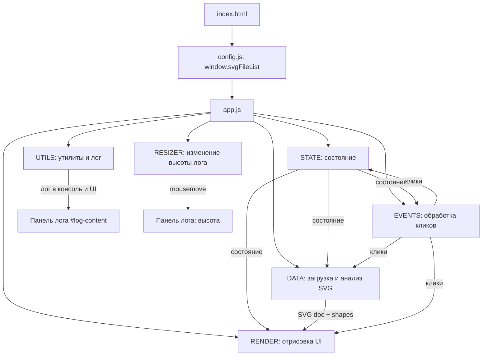
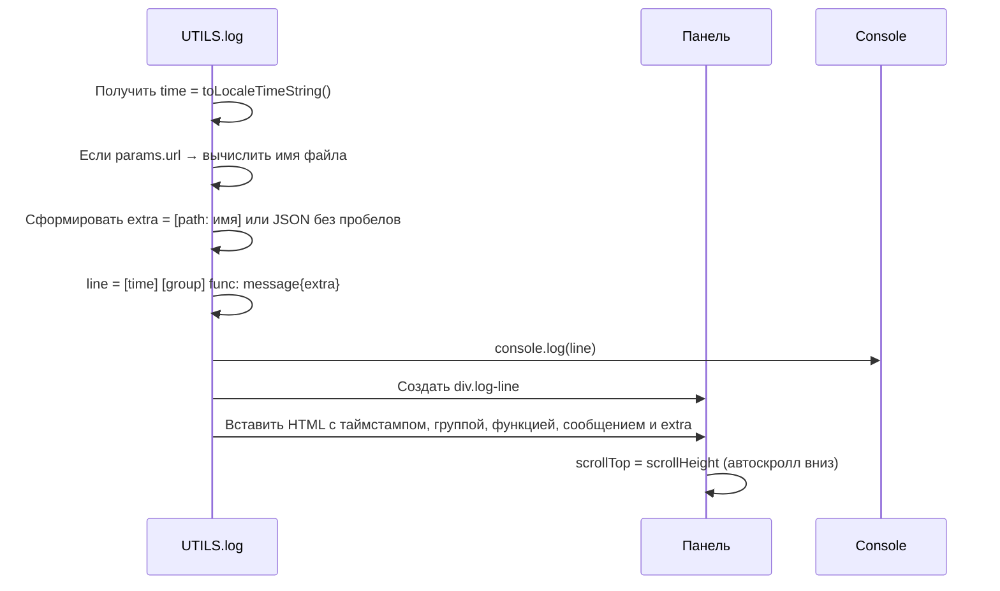
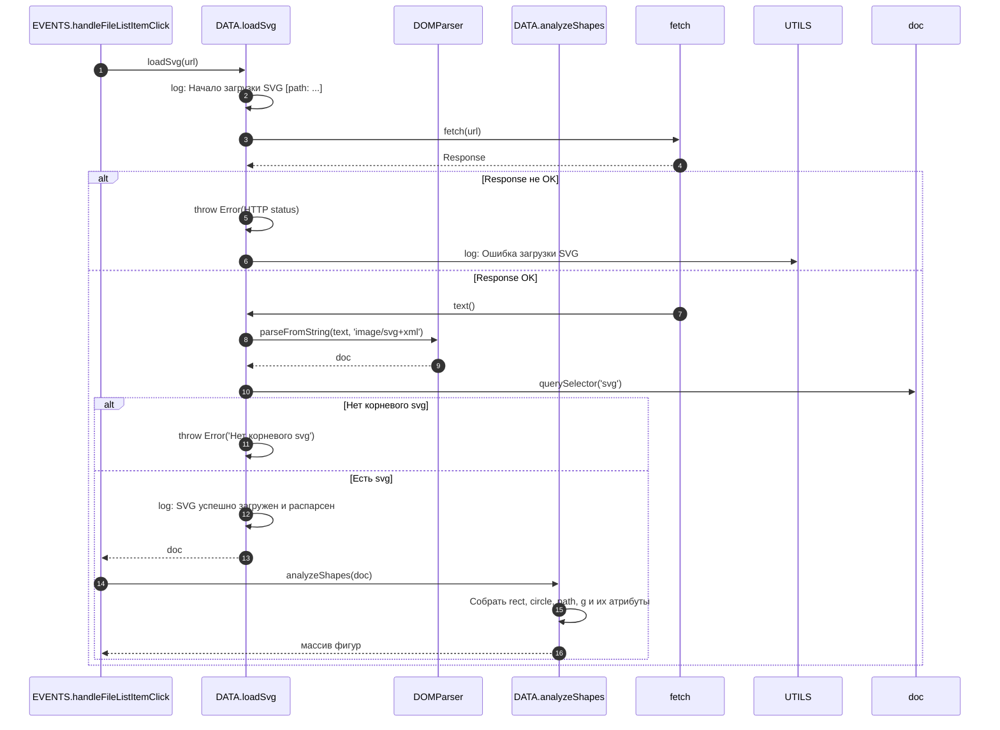
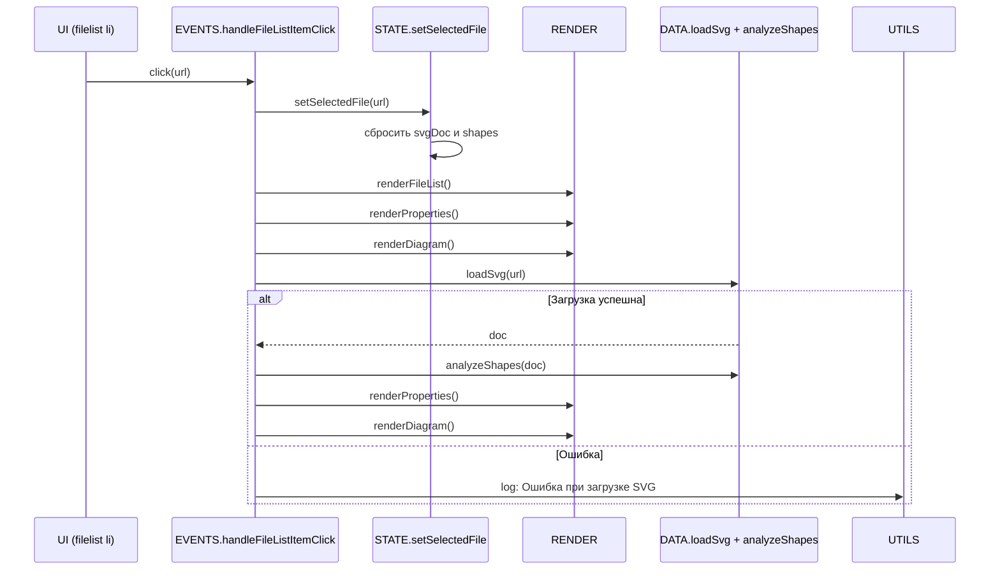
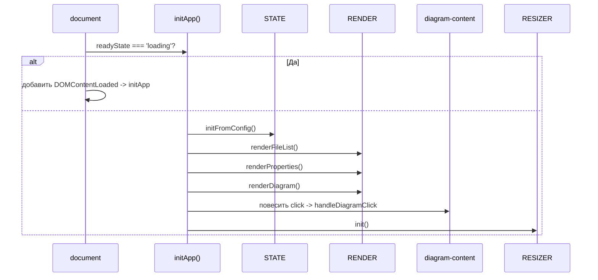
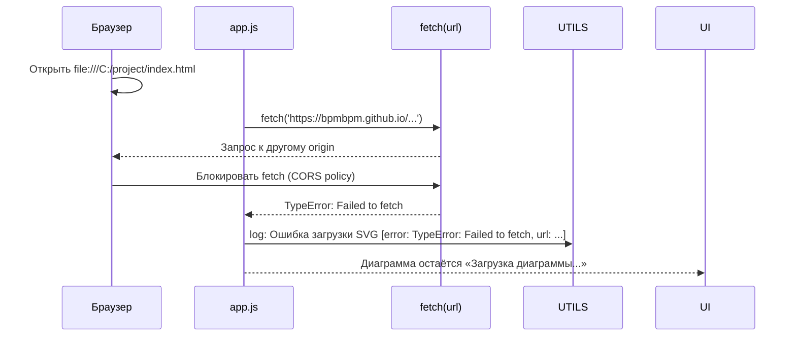

Ниже — полный, готовый к вставке ответ: исправленные Mermaid‑диаграммы (без скобок и конструкций, ломающих рендер) + краткое описание логики кода `app.js`. Эти диаграммы корректно отображаются в GitHub, Notion, Obsidian и других средах с поддержкой Mermaid.

---

## Общая архитектура приложения

Показывает, из каких модулей состоит приложение и как они связаны.



---

## UTILS — как формируется лог «в одну строку»

Здесь видно, как именно создаётся строка лога, откуда берётся `[path: file1.svg]` и как она попадает в UI и консоль.



---

## STATE — структура состояния (без проблемных символов)

Вместо полей со скобками — класс и примечание справа с перечнем атрибутов.

```mermaid
classDiagram
    class STATE {
        +initFromConfig()
        +isValid()
        +setSelectedFile(fileUrl)
        +clearSelection()
    }

    note right of STATE
        appState.fileList: массив URL
        appState.selectedFile: URL или null
        appState.svgDoc: DOMParser doc или null
        appState.shapes: массив фигур
    end
```

---

## DATA — загрузка и анализ SVG

Последовательность действий при загрузке файла: от `fetch` до парсинга и анализа фигур.



---

## RENDER — отрисовка UI

Логика отрисовки для каждого блока интерфейса в зависимости от состояния.

```mermaid
flowchart TD
    R[RENDER] --> R1[renderFileList]
    R1 -->|STATE.appState.fileList| R1a[Создать ul/li, повесить клики]
    R --> R2[renderProperties]
    R2 -->|!STATE.isValid()| R2a[Показать «Не выбран файл»]
    R2 -->|STATE.isValid() и shapes.length===0| R2b[Показать «В SVG не найдено фигур»]
    R2 -->|STATE.isValid() и shapes| R2c[Отрисовать таблицу фигур]
    R --> R3[renderDiagram]
    R3 -->|!STATE.isValid()| R3a[Показать «Выберите файл»]
    R3 -->|STATE.isValid() и svgDoc| R3b[Вставить cloneNode(svg)]
    R3 -->|STATE.isValid() и !svgDoc| R3c[Показать «Загрузка диаграммы...»]
```

---

## EVENTS — клик по файлу в filelist

Что происходит, когда пользователь кликает на файл: сброс состояния, отрисовка, загрузка и повторный рендер.



---

## EVENTS — клик в diagram без выбранного файла

Это именно тот случай, который ты просил: событие `diagram.click.no-selection` появляется в логе, но UI не меняется.

```mermaid
sequenceDiagram
    participant DIAG as diagram-content (click)
    participant E as EVENTS.handleDiagramClick
    participant S as STATE.isValid()
    participant U as UTILS.log

    DIAG->>E: click
    E->>U: log: Клик в область diagram
    E->>S: isValid()?
    alt false (файл не выбран)
        S-->>E: false
        E->>U: log: diagram.click.no-selection: Не выбран элемент filelist — действие невозможно
        E-->>end: ничего не менять в UI
    else true (файл выбран)
        S-->>E: true
        E->>U: log: Клик в diagram при выбранном файле (заглушка действия)
    end
```

---

## RESIZER — изменение высоты панели лога мышкой

Как работает ручка-ресизер: от нажатия до изменения `style.height` и логирования.

```mermaid
sequenceDiagram
    participant H as Ручка .resizer-handle
    participant R as RESIZER.onMouseDown
    participant M as RESIZER.onMouseMove
    participant U as UTILS.log

    H->>R: mousedown(e)
    R->>R: запомнить startY и startHeight
    R->>document: addEventListener('mousemove', onMouseMove)
    R->>document: addEventListener('mouseup', onMouseUp)
    loop Пока двигаем мышкой
        document->>M: mousemove(e)
        M->>M: diff = startY - e.clientY
        M->>M: newHeight = startHeight - diff
        alt newHeight < 60px
            M-->>end: игнорировать (минимальная высота)
        else
            M->>logPanel: style.height = `${newHeight}px`
            M->>U: log: Изменение высоты панели лога
        end
    end
    document->>onMouseUp: mouseup()
    onMouseUp->>document: removeEventListener('mousemove')
    onMouseUp->>document: removeEventListener('mouseup')
    onMouseUp->>U: log: Изменение размера панели лога завершено
```

---

## Инициализация приложения (initApp)

Что запускается при старте: инициализация состояния, отрисовка, подписка на события и ресайзер.



---

## CORS и запуск через локальный сервер

Почему при двойном клике по HTML ничего не работает и что делать.



---

### Что важно помнить

- **Пути в логах** появляются только когда передаётся `params.url` (например, в `loadSvg` и `handleFileListItemClick`). Пример строки:  
  `[10:15:30] [EVENTS] handleFileListItemClick: Клик по файлу в filelist [path: file1.svg]`.
- **Клик без файла** всегда даёт событие `diagram.click.no-selection` в логе — это реализовано в `EVENTS.handleDiagramClick`.
- **Ресайзер** работает за счёт изменения `style.height` у панели лога; минимальная высота — 60 px.
- **Запуск**: обязательно через локальный сервер (Live Server в VS Code или `python -m http.server`). При двойном клике `file://` `fetch` блокируется CORS.

Если скажешь, куда именно ты вставляешь эти диаграммы (GitHub README, Notion, Confluence и т.п.), могу дополнительно подстроить форматирование под эту платформу.
