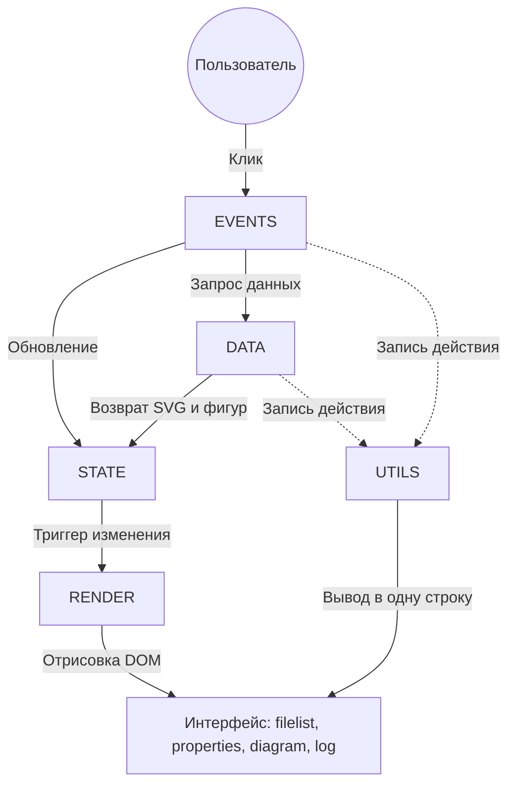
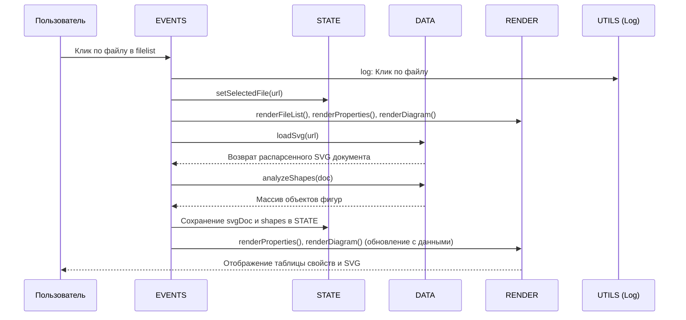

---

### 1. `doc.md` (Описание программы)

# Документация SVG Viewer (ver3)

## Краткое описание
SVG Viewer — это легковесное веб-приложение на чистом JavaScript (Vanilla JS) для просмотра SVG-файлов, анализа их внутренней структуры и отслеживания действий пользователя. Приложение разделено на четыре основные панели: список файлов, свойства элементов, визуальное отображение (diagram) и журнал событий (log).

## Архитектура
Приложение построено по модульному принципу, разделяющему ответственность (аналог паттерна MVC):
- **STATE**: Хранит текущее состояние приложения (выбранный файл, загруженный SVG-документ, массив распарсенных фигур).
- **DATA**: Отвечает за получение данных (загрузка SVG через `fetch`) и их анализ (парсинг DOM и извлечение атрибутов).
- **RENDER**: Отвечает исключительно за обновление DOM-элементов на основе данных из `STATE`.
- **EVENTS**: Обрабатывает действия пользователя (клики) и координирует вызовы `STATE`, `DATA` и `RENDER`.
- **UTILS**: Вспомогательные функции (форматированное логирование в одну строку, извлечение имени файла).
- **RESIZER**: Утилита для изменения размера нижней панели (лога) перетаскиванием верхней границы.

## Диаграммы (Mermaid)

### 1. Архитектура компонентов

### 2. Последовательность действий при выборе файла

## Структура файлов
- `index.html`: Каркас приложения (CSS Grid layout).
- `styles.css`: Стилизация, включая фиксацию заголовков панелей (`flex-shrink: 0`) и компактный вывод лога (`white-space: nowrap`).
- `config.js`: Конфигурационный файл со списком URL SVG-файлов.
- `app.js`: Вся бизнес-логика приложения.

